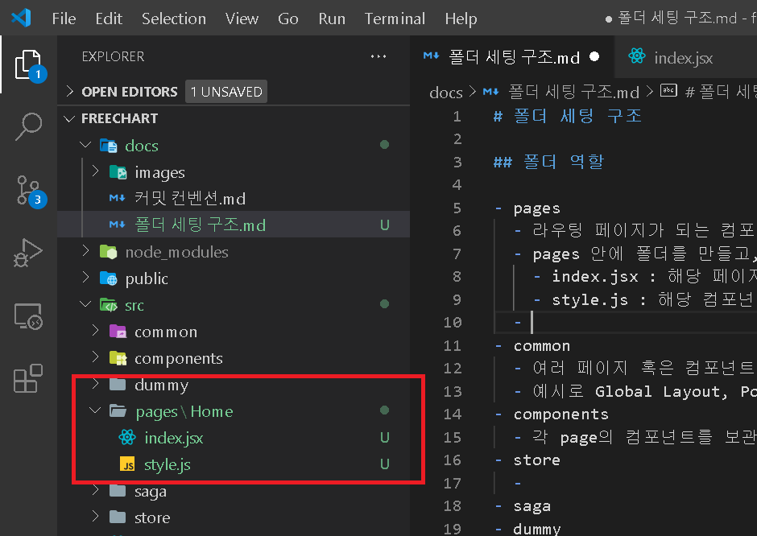
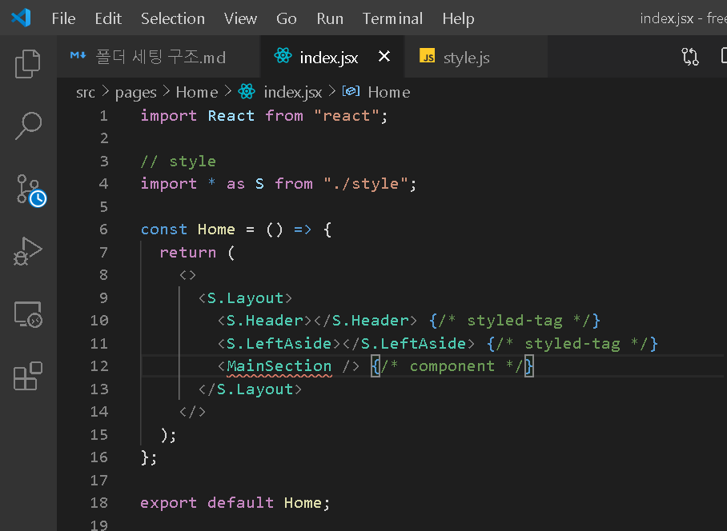
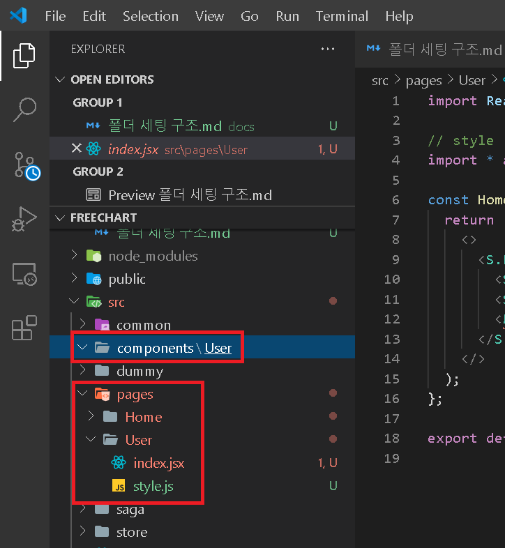

# 폴더 세팅 구조

## [폴더 역할]

### pages : 라우팅 페이지가 되는 컴포넌트들을 보관

1. pages 안에 폴더를 만들고, 그 폴더 안에 index.jsx와 style.js를 추가
   - index.jsx : 해당 페이지의 컴포넌트가 되는 react file
   - style.js : 해당 컴포넌트의 style을 담당하는 file
     
2. pages 아래에 있는 폴더의 첫글자는 대문자로 작성
3. styled-componets는 1대1 대응 형식으로 style을 적용하도록 권장. 또한, 각 style tag는 export 키워드를 붙임
   - style.js : 해당 컴포넌트의 style을 담당하는 file
     
4. index.jsx에서 style tag를 불러올 때, 아래 방식으로 import를 진행
   ```javascript
   // export로 선언한 변수를 *로 합치고 이를 S라는 키워드로 설정
   import * as S from "./style";
   ```
   이후 S 키워드를 붙이고 styled-components를 적용.
   S를 붙임으로써, 컴포넌트와 styeld-components를 구분할 수 있음
   

### common : 여러 페이지 혹은 컴포넌트에서 재사용되는 컴포넌트들을 보관하는 폴더

- 예시로 Global Layout, Post Card과 같이 범위가 넓거나 재사용이 많은 컴포넌트가 해당
- folder 및 file 세팅은 pages와 동일

### components : 각 page의 컴포넌트를 보관하는 폴더

- pages에서 한 file에 전부 작업하면 관리하기 힘들기 때문에, page 내부를 컴포넌트로 분할해서 관리
- 만약 User page의 folder를 만들었다면, components에서도 동일하게 User Folder를 생성
  
- folder 및 file 세팅은 pages와 동일

### store : front end의 데이터를 하나로 묶어놓는 폴더

- redux가 사용되는 시점이 됐을 때, store의 폴더 구조를 세팅하는게 좋을 것 같습니다.

### saga : redux의 비동기 처리를 처리해주고, 컴포넌트의 네트워크 통신 로직을 관리하기 위해 saga를 사용

- saga 폴더 또한 redux가 사용되는 시점에서 폴더 구조화를 하는게 좋을거 같습니다.

### dummy

- 서버와 네트워크 통신하기 전 dummy data를 보관하는 폴더
